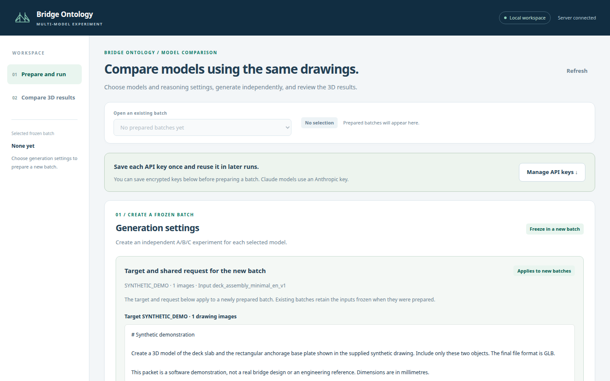

# Bridge Ontology Experiments

A local research application for studying how ontology representations affect the conversion of 2D bridge drawings into 3D models. Run independent A/B/C experiments with OpenAI and Anthropic models, convert their geometry JSON through one shared backend, and inspect the resulting models side by side.

**English edition, September 22, 2026.** Based on experiment engine 0.4.0, web application 0.2.5, and geometry backend 0.1.2 (the `package.json` version is the separate viewer bundle). This edition includes the latest local source snapshot and the September 17 diagnostic findings. It ships with an explicitly synthetic demonstration drawing. Original bridge drawings, credentials, and experiment outputs are not in this repository.


*The local web application, where a frozen A/B/C batch is prepared for the synthetic demonstration drawing before the 3D results are compared.*

## What is compared?

| Condition | Additional model context |
| --- | --- |
| A | No additional ontology knowledge |
| B | Prose statements projected from the ontology facts |
| C | Subject-predicate-object records projected from the same facts |

Each slot starts with an isolated conversation. Drawings, scope, common instructions, output contract, provider settings, and continuation limits are fixed within a model's A/B/C comparison. Multiple selected models run in separate processes. The researcher scores the results manually; the application does not grade engineering correctness.

The ontology contains **880 fact records**. Its information is supplied as model context; the generation path does not execute an OWL reasoner or a SHACL repair loop. Matching B/C fact records does not prove semantic equivalence between their natural-language and formal representations. See [experimental protocol](docs/experimental-protocol.md).

## Quick start on Windows

The pinned geometry environment was tested with Python 3.9 on Windows. API transport and the local server use the Python standard library. Node.js is only needed to rebuild the bundled 3D viewer.

```powershell
git clone https://github.com/youngbrain85/bridge-ontology-experiments.git
cd bridge-ontology-experiments
py -3.9 -m venv .venv
.\.venv\Scripts\python.exe -m pip install -r requirements-geometry.txt
.\04_web_app.cmd
```

The application normally opens at `http://127.0.0.1:8765`. If that port is occupied, it selects an available nearby port. The launcher also refuses to start a second instance while `webapp/runtime/server.json` records a running one. You can also start the server directly, but on Windows a second direct start can bind the same port instead of moving to the next one, so stop the running instance first:

```powershell
.\.venv\Scripts\python.exe -B -X utf8 webapp/server.py --package . --port 8765 --open
```

1. Review the **Synthetic demonstration** input. It is a software example, not a validated bridge design or a benchmark result.
2. Choose models and their provider-specific reasoning settings.
3. Prepare a named batch, then check its input integrity. Preparation does not call a model API.
4. In **API keys**, save the appropriate OpenAI and/or Anthropic key. Windows encrypts saved keys for the current user with DPAPI.
5. Start paid execution when you intend to generate new results. Preparation, viewing, and integrity checks do not incur API charges.
6. Inspect the status cards and generated GLB/DXF/OBJ files in the comparison view. Record manual assessments separately.
7. Use `05_stop_web_app.cmd` after active work finishes.

The defaults are one repetition per condition, a maximum of 128,000 output tokens, and at most two clarification continuations. The output budget includes reasoning and final answer tokens. A model with a smaller supported limit requires a lower common output cap. The catalog is a versioned research configuration, not a guarantee of current account access; see [provider notes](PROVIDER_NOTES.md).

## Use your own drawings

Place private drawing packets under the ignored `resources/private_data/` directory and update a local configuration as described in [input preparation](docs/input-preparation.md). The web application's input preview only accepts files inside `resources/`. Its default preparation template is `config.json`. Prepared experiments keep their own frozen configuration and input hashes.

**The English prompts and translated ontology are a new input protocol.** They do not reproduce the older Korean-language experiments. Keep old frozen inputs and results intact and compare A/B/C within one version. Do not combine results from different languages or packet versions as if only the ontology condition had changed.

## Offline checks

```powershell
.\.venv\Scripts\python.exe -B -X utf8 scripts/verify_release.py
.\.venv\Scripts\python.exe -B -X utf8 -m unittest discover -s . -p test_providers.py
.\.venv\Scripts\python.exe -B -X utf8 -m unittest discover -s verification -p "test_*.py"
.\.venv\Scripts\python.exe -B -X utf8 -m unittest discover -s backend -p "test_*.py"
```

These checks use mock responses and synthetic fixtures. They do not require API keys or make paid model requests, and they run on any operating system; only on Windows do the web tests exercise the real DPAPI key store, elsewhere an in-memory stand-in is used. To test conversion alone:

```powershell
.\.venv\Scripts\python.exe -B -X utf8 backend/geometry_backend.py --input examples/synthetic_model.json --schema resources/shared/minimal_v1/common_output.schema.json --output outputs/synthetic-conversion
```

Use a new output directory on subsequent conversion runs. This file is a hand-authored software fixture, not an AI-generated experiment result.

To rebuild the optional viewer bundle with the pinned Node.js dependencies:

```powershell
npm ci
npm run build:viewer
```

`npm run test:ui` performs offline browser checks with synthetic API responses. It uses installed Microsoft Edge on Windows, a browser specified by `PLAYWRIGHT_EXECUTABLE_PATH`, or Playwright Chromium installed with `npx playwright install chromium`.

## Repository layout

```text
experiment.py          Frozen experiment preparation, execution, and audit
batch_protocol.py      Multi-model batch definition and verification
frozen_runtime.py      Loads the frozen software copy inside a worker process
providers.py           OpenAI and Anthropic request/response adapters
knowledge_builder.py   Aligned prose and structured fact projections
review_export.py       Geometry conversion and blinded review copies
backend/               Shared deterministic geometry conversion
webapp/                Local server, credential storage, and comparison UI
resources/ontology/    English ontology and its model-context representation
resources/shared/      minimal_v1/ holds the current prompts and contract; the
                       top-level 0.1.0 set is legacy and used only by backend tests
resources/cases/       Synthetic demonstration packet only
examples/              Hand-authored conversion fixture
verification/          Offline orchestration, isolation, and review-export tests
docs/                  Protocol, input setup, and diagnostics
scripts/               Release integrity and language checks
CHANGELOG.md           Release notes
```

## Current limitations

- A successful API response or GLB conversion does not establish dimensional, structural, or engineering correctness.
- The current pipeline can preserve valid-looking geometry with missing details, incorrect plate orientation, or an open mesh. It does not automatically repair those errors.
- Equal reasoning labels across providers do not represent equal computation.
- A shared camera direction does not align differently defined bridge axes; full-model fitting can also change the apparent scale of an anchorage.
- The September pilot is one case with one repetition per condition. It is not evidence of a general provider ranking. See [diagnostic findings](docs/provider-comparison-notes.md).

## Data, contributions, and licensing

Never commit real API keys, encrypted credential stores, raw requests/responses, or private drawing packets. Runtime folders and private inputs are ignored. The repository language is English, including documentation, UI text, and commit messages. Translation changes to prompts or ontology facts require a new input-protocol version and fresh input hashes.

Third-party viewer licenses are included in `webapp/THIRD_PARTY_NOTICES.txt`. No open-source license is granted for the project code by this release; obtain the owner's permission before redistribution outside authorized access.

After intentional source changes, regenerate `release_manifest.json` with `python scripts/write_release_manifest.py`, then run `scripts/verify_release.py`. Text hashes normalize line endings so the same release can be verified after a Windows or Linux checkout.
